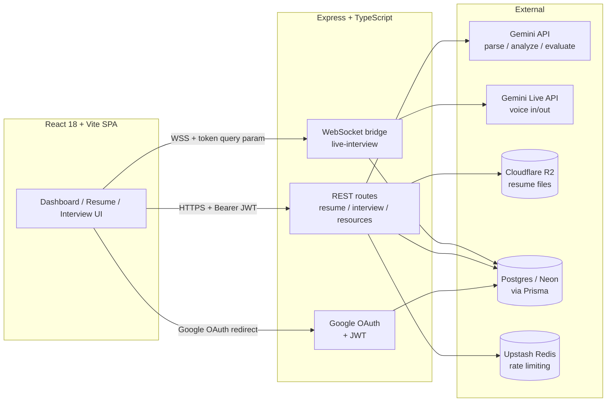

# PrepSense

**AI resume analysis + voice mock interviews, adapted to any field — not just software engineering.**

A fresher applying for a Product Manager role gets product-sense and execution questions. A marketer gets campaign-strategy questions. A finance analyst gets DCF and valuation questions. Same product, same pipeline — the system reasons about what "good" looks like for the target role instead of running one hardcoded rubric.

> **Status:** feature-complete through the core loop (auth → resume analysis → voice interview → dashboard) and running locally. Not yet deployed to a public URL — see [What's Next](#whats-next).

---

## Table of Contents
- [The Problem](#the-problem)
- [What It Does](#what-it-does)
- [Why It's Different](#why-its-different)
- [Architecture](#architecture)
- [Tech Stack](#tech-stack)
- [Key Decisions & Trade-offs](#key-decisions--trade-offs)
- [Success Metrics](#success-metrics)
- [Running Locally](#running-locally)
- [What's Next](#whats-next)

---

## The Problem

Freshers across every field — engineering, product, marketing, finance, design — get generic, Grammarly-level resume feedback, and have no low-stakes way to rehearse interviews out loud before the real thing. Text-based prep tools don't build the verbal fluency and pacing that actual interviews test. Generic tools also don't know that a "good answer" for a data analyst interview looks nothing like a good answer for a sales interview.

## What It Does

1. **Target-role-aware resume analysis** — upload a PDF/DOCX, specify a target role (free text, any field), optionally paste a job description. Get back:
   - A deterministic, rule-based **format-compatibility check** (scanned-PDF detection, missing sections, non-standard headings) — kept separate from the AI content score on purpose, since one is objective and one isn't.
   - An AI content-quality score and JD match %, with section-by-section feedback phrased for that field's norms.
   - At least 3 bullet-level rewrite suggestions with before/after text.
   - Resume version history — re-upload and compare iterations of the same resume.

2. **Live voice mock interview** — the LLM first infers 4–5 question categories appropriate to the target role (e.g. `technical / system_design / behavioral` for an SDE vs. `product_sense / execution / metrics` for a PM), then generates 5–7 personalized questions from the resume + role. The interview runs as a real-time voice conversation over the Gemini Live API (WebSocket-streamed audio both directions, not a record-then-upload flow), with each answer scored on STAR structure, specificity, and relevance immediately after.

3. **Progress dashboard** — resume score history, interview score trend across sessions, aggregated "recurring weak areas" mined from every evaluated answer, and a self-reported confidence delta (1–5 rating captured before and after each session).

4. **Resources hub + community** — role-specific interview prep guides (SWE, PM, marketing, finance, data, design) and a moderated success-stories wall.

## Why It's Different

Most fresher "resume analyzer" projects are a GPT wrapper with a text box hardcoded to one role. This one reasons about the target role at every stage — question categories, evaluation rubric, resume feedback tone — which is a harder, more general engineering problem than a single-role tool. The live voice interview is the bigger differentiator: it forces real system design (streaming audio state, turn-taking, WebSocket lifecycle) rather than just prompt-chaining.

## Architecture



**Voice interview data flow:**
```
1. Client requests session -> Server: Gemini infers question categories + generates
   5-7 questions from resume+role -> stored in Postgres, order fixed
2. Client opens WebSocket (?sessionId&token) -> Server verifies JWT, scopes the
   session lookup to that user, opens a Gemini Live bridge
3. Audio streams both directions over the WebSocket in real time (16kHz PCM in,
   24kHz PCM out) - no record-then-upload round trip
4. After each answer: transcript -> Gemini evaluation (STAR / specificity /
   relevance) -> score + feedback persisted -> next question
5. After the last question: Gemini generates a session summary; client shows
   overall score, per-question breakdown, and top improvement areas
```

## Tech Stack

| Layer | Choice |
|---|---|
| Frontend | React 18, Vite, TypeScript, Tailwind, shadcn/ui, TanStack Query, React Router 7 |
| Backend | Express + TypeScript, feature-based route modules |
| Database | PostgreSQL (Neon, serverless) via Prisma ORM |
| Auth | Google OAuth 2.0 (Passport.js) issuing a JWT, sent as a Bearer token; the WebSocket handshake carries the same JWT as a query param since browsers can't set custom headers on a WS upgrade |
| AI | Gemini API for structured extraction / analysis / question generation / evaluation (all JSON-schema-constrained), called server-side only |
| Voice | Gemini Live API — native audio in and out over a persistent WebSocket, no separate STT/TTS vendor |
| File storage | Cloudflare R2 (S3-compatible), presigned URLs issued only after an ownership-checked DB lookup |
| Rate limiting | `express-rate-limit` with an Upstash Redis store (falls back to in-memory if Redis isn't configured), keyed per-user where authenticated |

## Key Decisions & Trade-offs

A few decisions worth being able to defend in an interview, not just having made:

- **Turn-based-feeling voice, but real streaming underneath.** The interview reads as ask → answer → next question, but audio is genuinely streamed both directions over one WebSocket rather than recorded-and-uploaded per turn. Full duplex (interrupting the AI mid-sentence) was scoped out — real value for build-time risk in the time available.
- **One AI vendor for text, voice-in, and voice-out.** Using Gemini for LLM calls, transcription, and TTS/voice generation means one API key, one rate limit to watch, no per-minute billing across three vendors to reconcile. The trade-off is vendor lock-in on the AI layer; acceptable given the free-tier quota comfortably covers this project's scale.
- **Format compatibility is deterministic, AI quality is not — and the schema keeps them separate.** `Analysis.formatCompatibility` is a rule-based check (scanned PDF, missing sections, non-standard headings); `Analysis.aiQualityScore` is explicitly documented as Gemini's subjective read, not a real ATS simulation. Conflating the two would make the score meaningless as a signal.
- **No background job queue.** A persistent Express process handles multi-second Gemini/voice calls fine without a BullMQ worker at this scale. The queue-based scaling path is a known next step, not something worth the build risk before there's real usage to justify it.
- **Auth is JWT Bearer tokens, not session cookies.** Consistent with a stateless API and simple for a client/server split across two origins; the trade-off (token theft if XSS ever existed) is mitigated by there being zero `dangerouslySetInnerHTML`/raw-HTML-injection points anywhere in the client — verified directly, not assumed.

## Success Metrics

Metrics this product was built to track (defined in the original PRD, several implemented end-to-end in code):

- Upload → analysis completion rate
- % of users who start a voice session who complete it
- Return usage (second session rate)
- **Self-reported confidence delta** — a 1–5 rating captured before and after each mock interview session, aggregated on the dashboard. This is implemented and live, but has **no real user data yet** — it will populate once real candidates use the product, which is the current next step, not a number to report yet.

## Running Locally

**Prerequisites:** Node 18+, a Postgres database (Neon free tier works), a Google OAuth client, a Gemini API key, a Cloudflare R2 bucket.

```bash
npm run install:all          # installs root, server, and client deps

# copy and fill in both env files
cp server/.env.example server/.env
cp client/.env.example client/.env

cd server
npm run prisma:push          # sync schema to your database
npm run prisma:seed          # seed the Resources articles
cd ..

npm run dev                  # runs server (:3000) and client (:5173) concurrently
```

Required server env vars: `DATABASE_URL`, `JWT_SECRET`, `GOOGLE_CLIENT_ID`, `GOOGLE_CLIENT_SECRET`, `GOOGLE_CALLBACK_URL`, `GEMINI_API_KEY`, `R2_ACCESS_KEY_ID`, `R2_SECRET_ACCESS_KEY`, `R2_ENDPOINT`, `R2_BUCKET_NAME` — see `server/.env.example`. `JWT_SECRET` has no fallback; the server intentionally fails to start without it.

## What's Next

- Deploy client (Vercel) + server (Railway/Render) as two services and get a real public URL.
- Get 5–10 real candidates to use it end-to-end and capture actual completion-rate and confidence-delta numbers instead of targets.
- Add automated tests and a CI pipeline — currently none exist.
- Revisit the deferred build-risk items from the original PRD: Hindi-English bilingual mode, a background job queue if usage grows past what a single Express process comfortably handles.
